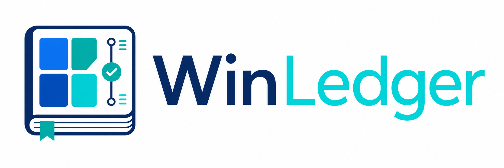
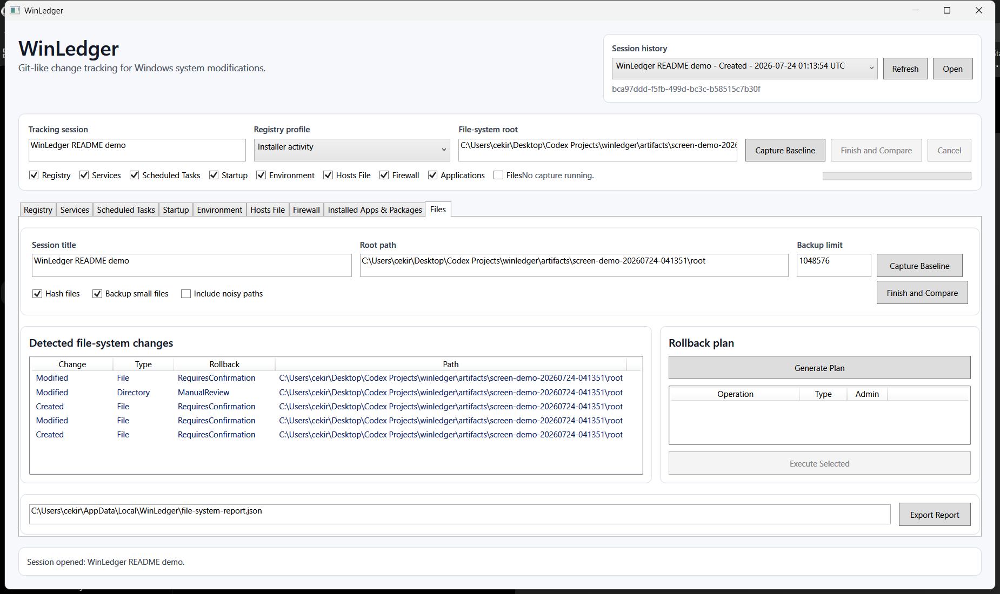
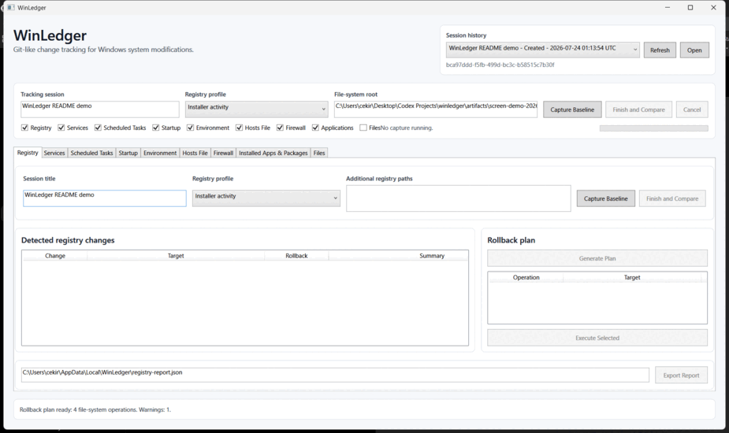
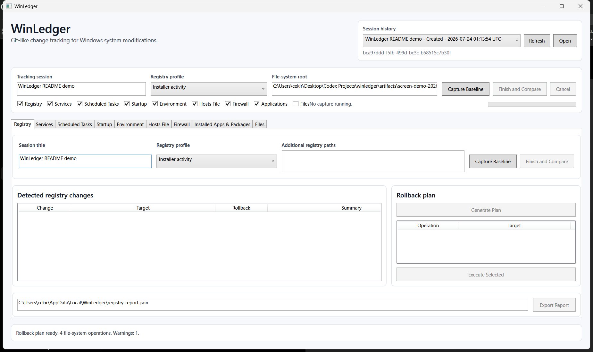
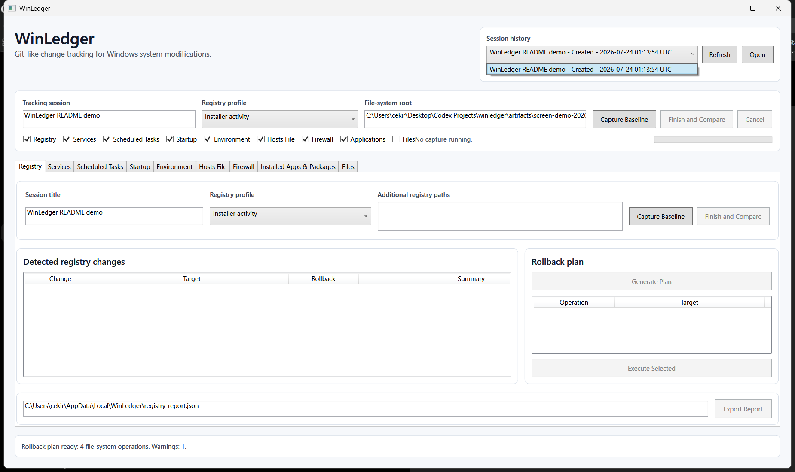
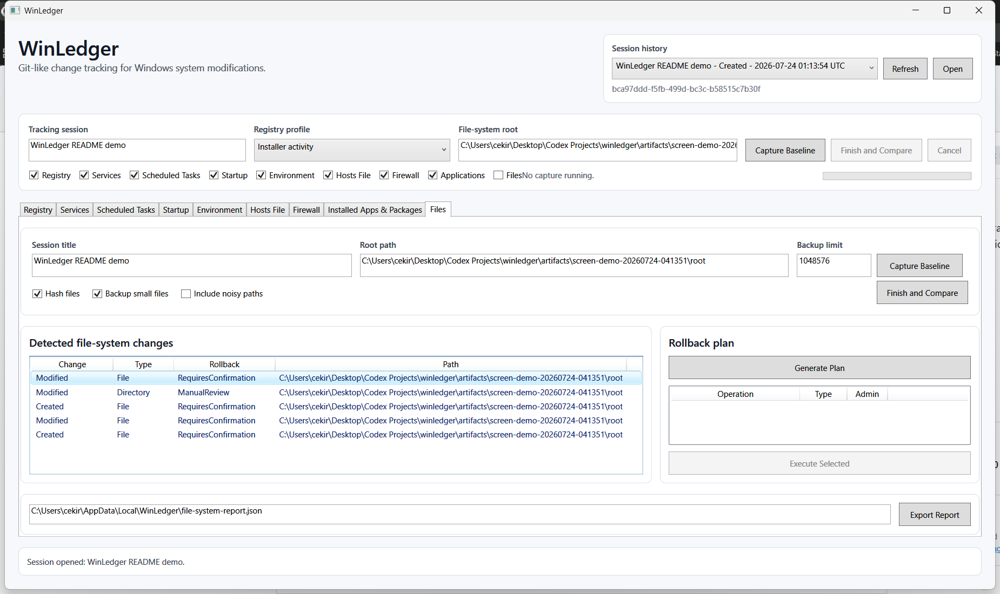
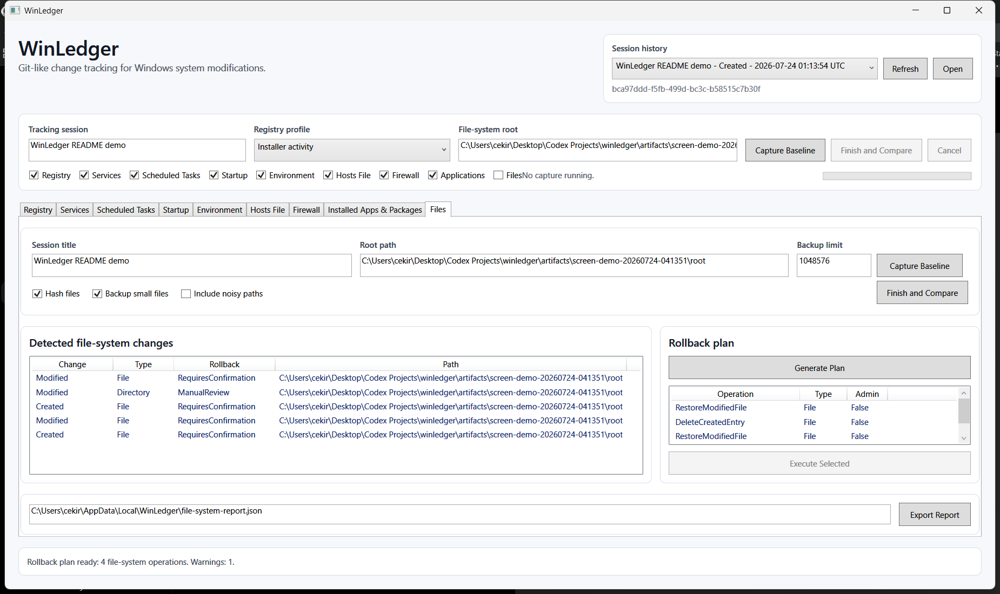

# WinLedger

<p align="center">
  
</p>

<p align="center">
  <strong>Git-like change tracking for Windows system modifications.</strong>
</p>

<p align="center">
  <a href="https://github.com/fanyqe/winledger/releases">Download portable build</a>
  |
  <a href="#quick-start">Quick start</a>
  |
  <a href="docs/rollback-limitations.md">Rollback limits</a>
</p>

<p align="center">
  
</p>

WinLedger records Windows system changes before and after you run an installer, script, tweak tool, driver package, or manual configuration change. It helps you answer what changed on the machine, which areas were affected, and which supported operations can be reviewed for conservative rollback. WinLedger stores its data locally and is built for auditable before-and-after evidence, not hidden cleanup or cloud analysis.

## Demo

<p align="center">
  
</p>

## Features

- Local tracking sessions stored in SQLite.
- Before-and-after snapshots for selected Windows subsystems.
- Comparison views grouped by subsystem with readable summaries.
- WPF desktop app plus a CLI preview for scripted flows.
- JSON, HTML, and plain-text reports.
- Registry `.reg` export and registry PowerShell rollback script export.
- Conservative rollback planning with validation before mutation.
- Restricted elevated rollback helper for supported administrator operations.
- Portable `win-x64` package output.
- No telemetry, cloud account, advertisements, or hidden network analysis.

## Current Scope

WinLedger currently tracks these areas:

- Windows Registry values and selected keys.
- Windows Services.
- Scheduled Tasks.
- Startup entries.
- User and machine environment variables.
- Hosts file changes.
- Windows Firewall rules.
- Installed application registrations and AppX/MSIX package metadata.
- Selected-root file-system changes, with NTFS change journal state when Windows exposes it.

## Screenshots

All screenshots below were captured from the same WinLedger WPF window using a real local file-system tracking session.

| Main window | Session history |
| --- | --- |
|  |  |

| Comparison | Change details |
| --- | --- |
|  |  |

| Rollback plan |
| --- |
|  |

## Supported Platform

| Area | Support |
| --- | --- |
| Operating system | Windows desktop releases supported by the .NET 10 Windows Desktop Runtime. Development and screenshots were verified on Windows 11 x64. |
| Portable package | `win-x64` by default. |
| App framework | WPF targeting `net10.0-windows`. |
| Development SDK | .NET 10 SDK `10.0.302`, pinned in `global.json`. |
| Runtime | The default portable package is self-contained. Framework-dependent builds require the matching .NET 10 Windows Desktop Runtime. |

## Quick Start

### Download

1. Open the [WinLedger Releases page](https://github.com/fanyqe/winledger/releases).
2. Download the portable `WinLedger-<version>-win-x64-portable.zip` package when a release asset is available.
3. Extract the zip.
4. Start the desktop app from `app\WinLedger.App.exe`.

### Build From Source

Use the SDK pinned by `global.json`. On this machine, the pinned SDK is installed under the current user profile:

```powershell
& "$env:USERPROFILE\.dotnet\dotnet.exe" restore WinLedger.sln
& "$env:USERPROFILE\.dotnet\dotnet.exe" build WinLedger.sln --configuration Release --no-restore
& "$env:USERPROFILE\.dotnet\dotnet.exe" test WinLedger.sln --configuration Release --no-build
```

Run the WPF app:

```powershell
& "$env:USERPROFILE\.dotnet\dotnet.exe" run --project src\WinLedger.App\WinLedger.App.csproj
```

Create a portable package:

```powershell
.\build\Package-Portable.ps1 -Configuration Release -Runtime win-x64 -Version 0.1.0
```

The package is written to `artifacts\release` and includes the desktop app, CLI preview, elevated helper, license, security notes, README, and docs.

## Basic Use

1. Enter a tracking session name.
2. Choose the subsystems to include.
3. For file-system tracking, choose the monitored root path and backup limit.
4. Click `Capture Baseline`.
5. Run the installer, script, tweak, or manual change you want to inspect.
6. Click `Finish and Compare`.
7. Review detected changes, export a report, or generate a rollback plan for supported operations.
8. Reopen saved sessions from `Session history`.

## CLI Preview

Show available commands:

```powershell
& "$env:USERPROFILE\.dotnet\dotnet.exe" run --project src\WinLedger.Cli -- --help
```

Minimal session flow:

```powershell
& "$env:USERPROFILE\.dotnet\dotnet.exe" run --project src\WinLedger.Cli -- session create .\winledger.db "Installing ExampleApp"
& "$env:USERPROFILE\.dotnet\dotnet.exe" run --project src\WinLedger.Cli -- session list .\winledger.db
& "$env:USERPROFILE\.dotnet\dotnet.exe" run --project src\WinLedger.Cli -- session show .\winledger.db <session-id>
```

Minimal file-system flow:

```powershell
& "$env:USERPROFILE\.dotnet\dotnet.exe" run --project src\WinLedger.Cli -- files-capture .\winledger.db <session-id> Baseline .\Sandbox --backup-small-files 262144
& "$env:USERPROFILE\.dotnet\dotnet.exe" run --project src\WinLedger.Cli -- files-capture .\winledger.db <session-id> Comparison .\Sandbox --backup-small-files 262144
& "$env:USERPROFILE\.dotnet\dotnet.exe" run --project src\WinLedger.Cli -- files-compare .\winledger.db <baseline-snapshot-id> <comparison-snapshot-id> .\file-system-report.json
```

Other subsystem commands follow the same capture/compare pattern.

## Rollback Limits

WinLedger is not a virtual machine, antivirus, registry cleaner, optimizer, sandbox, or perfect System Restore replacement. Rollback is best-effort, subsystem-dependent, and intentionally conservative.

Supported rollback operations validate the expected current state before writing. If the machine changed again after the comparison snapshot, rollback can stop or report a conflict instead of blindly mutating the system.

Current rollback boundaries:

- Registry rollback covers value-level operations; whole-key rollback is manual review.
- Service rollback covers start mode and delayed automatic start; it does not create, delete, start, stop, or reconfigure service executables, accounts, or dependencies.
- Scheduled task rollback covers newly created tasks and enabled-state changes; it does not reconstruct full task definitions.
- Startup rollback covers newly created Startup folder entries; registry Run keys, services, and scheduled tasks stay tied to their native subsystem rollback paths.
- Environment rollback restores tracked variable values after validation; PATH changes restore the full previous variable value.
- Hosts file rollback restores the full tracked file bytes after validation.
- Firewall rollback covers newly created rules and enabled-state changes; rule recreation and deep rule edits are manual review.
- Installed application rollback is manual-review only; WinLedger does not run uninstallers or remove AppX/MSIX packages in the current release.
- File-system rollback covers newly created entries and backed-up deleted or modified files inside the monitored root; large files without backup data, non-empty directories, reparse points, and hash-backed renames require review.

See [docs/rollback-limitations.md](docs/rollback-limitations.md) for subsystem-level details.

## Documentation

- [Architecture](docs/architecture.md)
- [Data format](docs/data-format.md)
- [Rollback limitations](docs/rollback-limitations.md)
- [Threat model](docs/threat-model.md)
- [Release process](docs/release-process.md)
- [Security policy](SECURITY.md)
- [Roadmap](ROADMAP.md)

## Contributing

WinLedger favors deterministic, auditable behavior over heuristics. See [CONTRIBUTING.md](CONTRIBUTING.md) before opening a pull request.

## License

WinLedger is released under the [MIT License](LICENSE).
